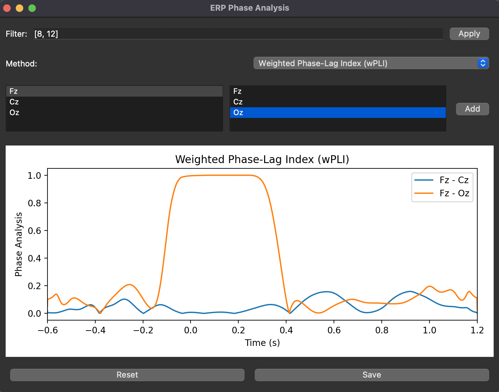

# ERP-Phase-Analysis
This repository contains code for ERP (Event-Related Potential) Phase Analysis. The software provides an interface to perform phase analysis on ERP data using several methods and channel selections.

# Features
- Analysis of ERP data with multiple phase analysis methods.
- Selection of specific channels for targeted analysis.
- Supported methods:
    - Phase Locking Value (PLV)
    - Imaginary Part of Phase Locking Value (iPLV)
    - Phase Lag Index (PLI)
    - Weighted Phase Lag Index (wPLI)

# Prerequisites
To run this software, ensure you have the following prerequisites installed:

- Python 3.8+
- mne (For handling mne.Epochs)

# Usage
When using this code you can chose to use the a GUI application by doing the following:
```python
from erp_phase_analysis import ERPPhaseApp

epochs = ... # Your mne.Epochs() Object

phase_data = ERPPhaseApp(epochs)
```
This will open a window that allows for filtering, method and channel selection.



Useful shortcuts:
- Ctrl + A: Add selected channels to plot.
- Ctrl + R: Reset plot
- Ctrl + S: Save plot

If you prefer to run via code, you can find the methods functions:
```python
from erp_phase_analysis import calculate_cross_spectrum_hilbert,
    calculate_plv,
    calculate_iplv,
    calculate_pli,
    calculate_wpli

# all methods receive (epochs_data, channel1_index, channel2_index) as inputs

epochs_data = epochs.get_data()
plv = calculate_plv(epochs_data, 0, 1)

```

# Contributing
Pull requests are welcome. For major changes, please open an issue first to discuss what you would like to change.

# License
This project is licensed under the MIT License - see the LICENSE.md file for details.

